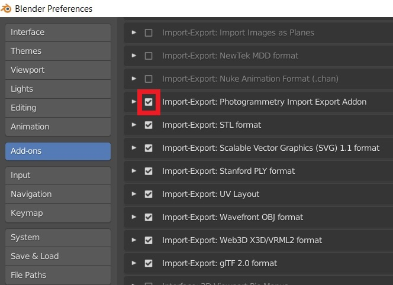

# Blender-addon-photogrammetry

This documentation describes an addon for Blender that allows to import different reconstruction results of several Structure from Motion and Multi-View Stereo libraries.

Import and export worked on Blender 3.6.5
All informations and original project can be fin here:  https://blender-photogrammetry-importer.readthedocs.io/en/latest/index.html
This repo is made in to develop on our feature if we want to improve it()

Supported libraries (data formats):

- Colmap (Model folders (BIN and TXT), workspaces, NVM, PLY)
- Meshroom (MG, JSON, SfM, PLY)
- MVE (MVE workspaces)
- Open3D (JSON, LOG, PLY)
- OpenSfM (JSON)
- OpenMVG (JSON, NVM, PLY)
- Regard3D (OpenMVG JSON)
- VisualSFM (NVM)

In addition, the addon supports some common point cloud data formats:

- Polygon files (PLY)
- Point Cloud Library files (PCD)
- LASer files (LAS)
- LASzip files (LAZ)
- Simple ASCII point files (ASC, PTS, CSV)

Requires pillow to read image sizes from disk.
Requires pillow for point color computation.
Requires pyntcloud for parsing. 4
Requires laspy for parsing. 5 Requires lazrs for parsing.

___
# Installation

### Install the addon by
- Opening the preferences of Blender (Edit / Preferences ...)
- Select Add-ons in the left toolbar
- Click on Install... in the top toolbar
- Navigate to the photogrammetry_importer.zip file, select it and click on Install Add-on
- Scroll down to **ACTIVATE the addon**, i.e. check the bounding box left of Import-Export: Photogrammetry Import Export Addon (see image below)

### Install Optional Dependencies
This addon uses Pillow to read the (missing) image sizes from disk - required by the MVE, the Open3D and the VisualSFM importer. Pillow is also used to compute the (missing) point colors for OpenMVG JSON files. Using Pillow instead of Blender’s image API significantly improves processing time. Furthermore, this addon uses Pyntcloud to import several point cloud formats such as .ply, .pcd, .las, .laz, .asc, .pts and .csv. For parsing .las and .laz files Laspy 2.0 (or newer), Lazrs and Pyntcloud 0.3 (or newer) is required.

### Installation using the GUI
Requires Blender 2.83.5 or newer. Administrator privileges might be required to install the dependencies (dependending on the location of the Blender installation directory).

Clicking on Download and Install Optional Dependencies installs pip (if not already present) and uses the pip executable to install the actual dependencies. Start Blender from the command line to see the installation progress and potential error messages.

Note: If you experience problems while updating the dependencies, try a fresh Blender installation.

Note: If you use VSCode with Blender VSCode to run this addon, the installation of laspy will fail. In this case you need to install it manually (see below).

other way can be find on this [page](https://blender-photogrammetry-importer.readthedocs.io/en/latest/installation.html).
