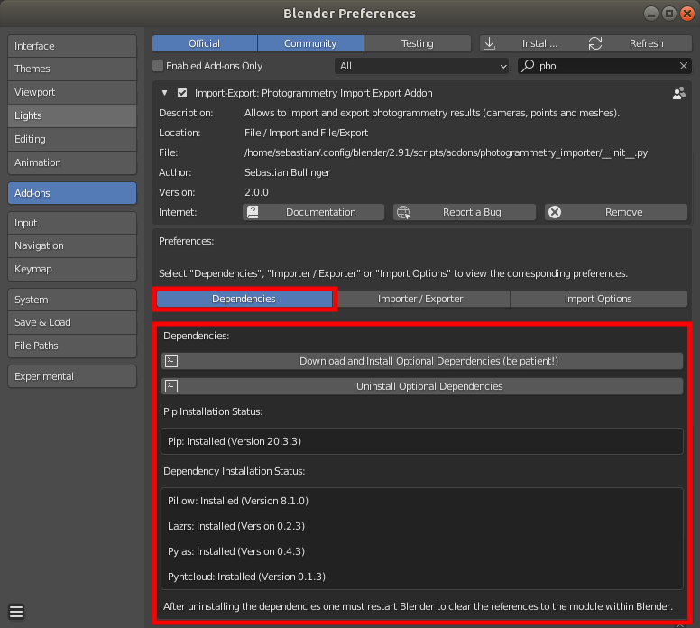
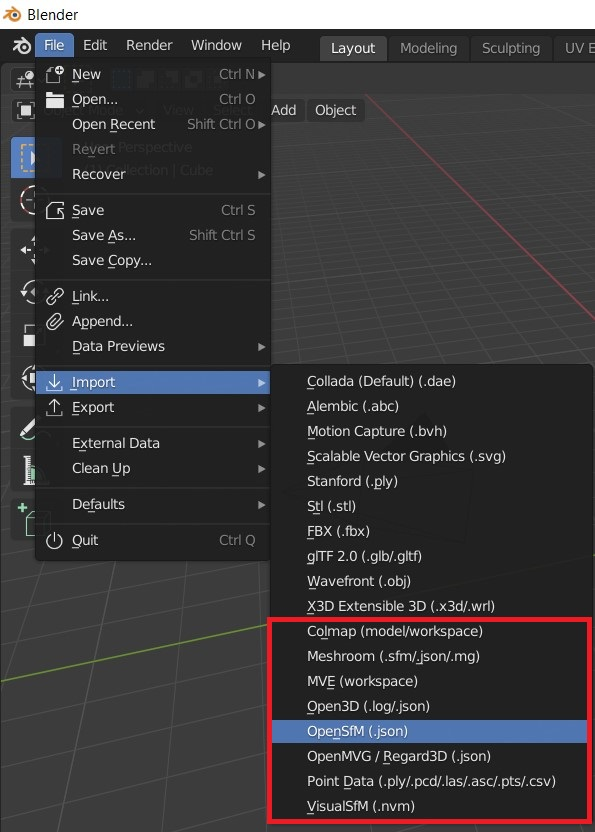
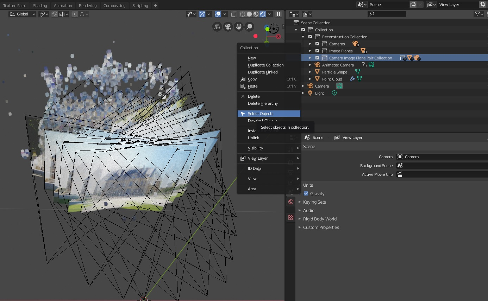
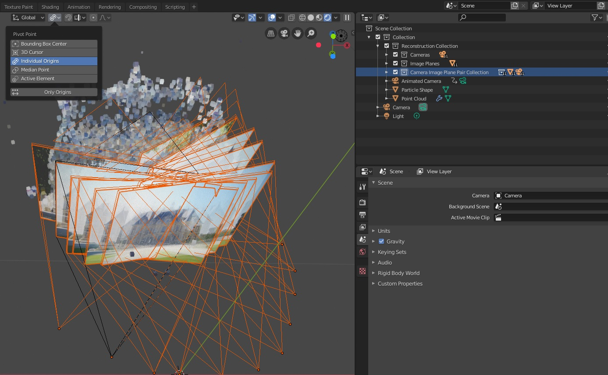
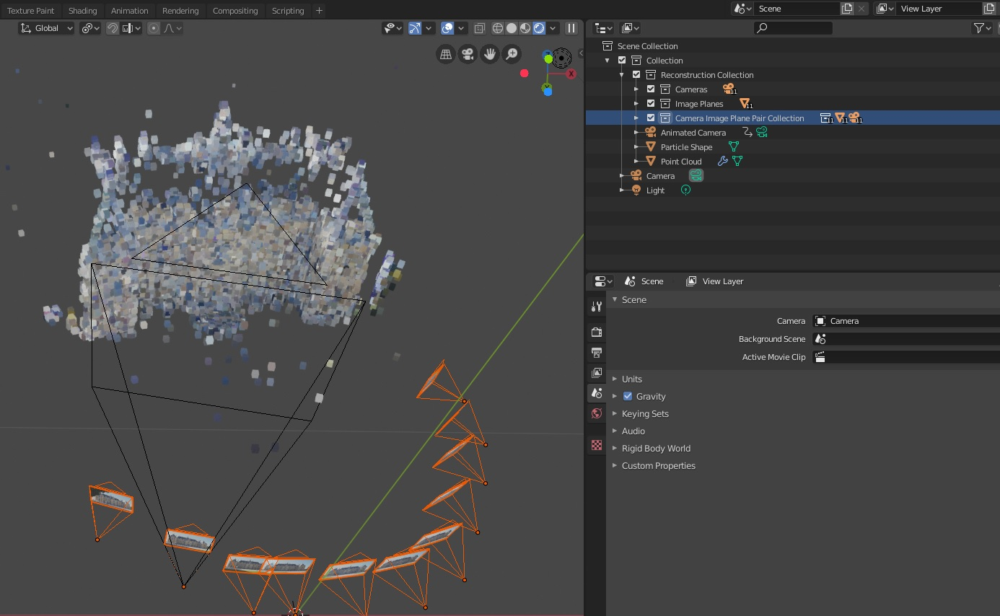
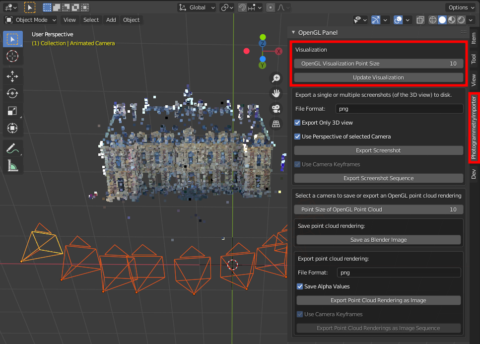
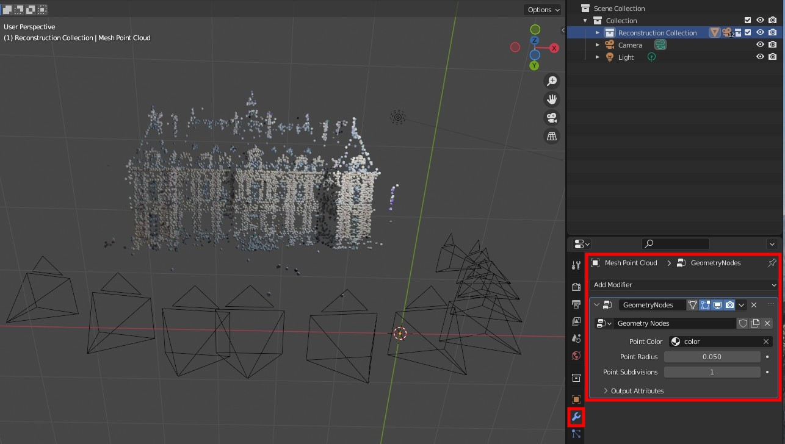
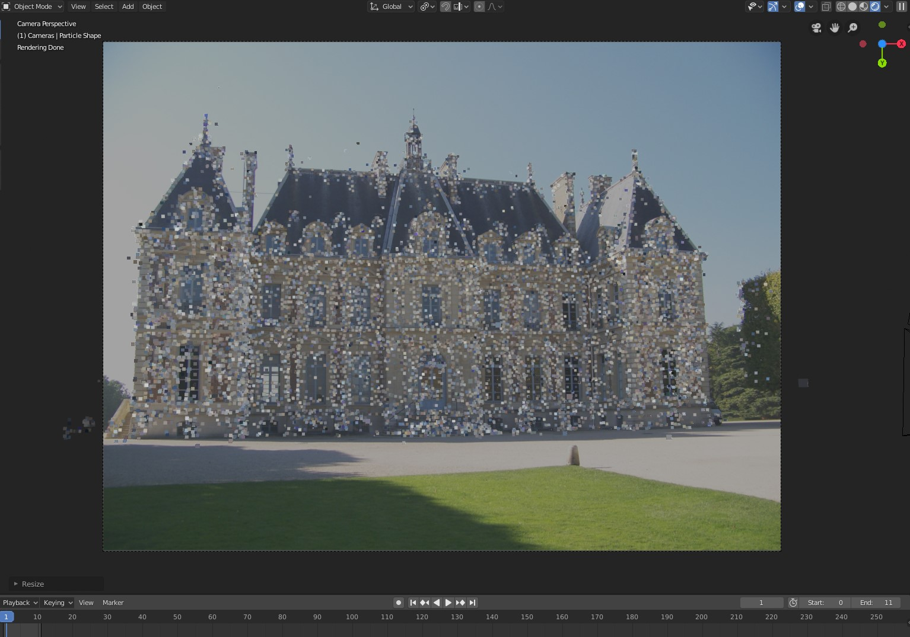
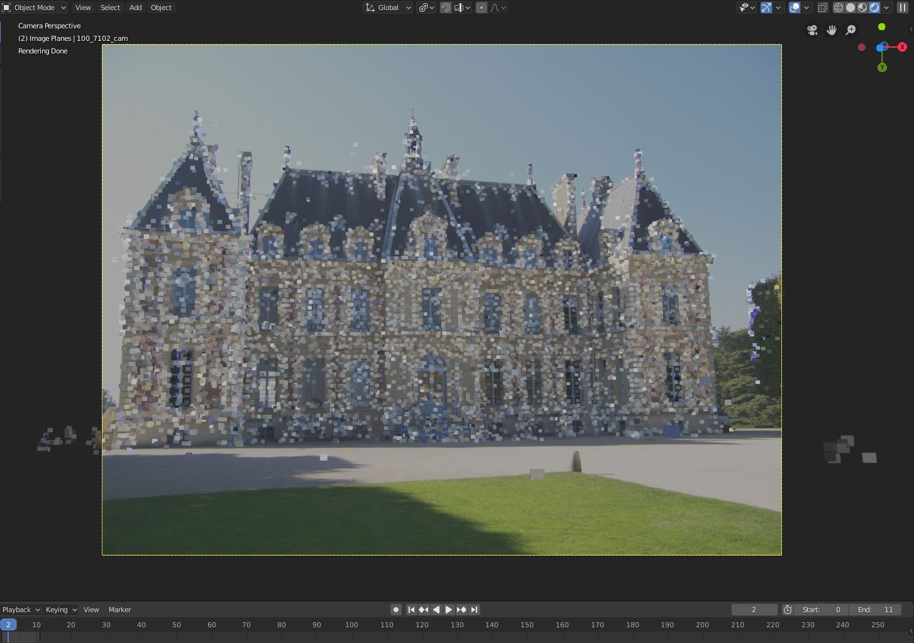
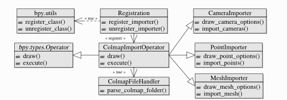

# Blender-addon-photogrammetry

This documentation describes an addon for Blender that allows to import different reconstruction results of several Structure from Motion and Multi-View Stereo libraries.

Import and export worked on Blender 3.6.5
All informations and original project can be fin here:  https://blender-photogrammetry-importer.readthedocs.io/en/latest/index.html

This repo is made in to develop on our feature if we want to improve it()

Supported libraries (data formats):

- Colmap (Model folders (BIN and TXT), workspaces, NVM, PLY)
- Meshroom (MG, JSON, SfM, PLY)
- MVE (MVE workspaces)
- Open3D (JSON, LOG, PLY)
- OpenSfM (JSON)
- OpenMVG (JSON, NVM, PLY)
- Regard3D (OpenMVG JSON)
- VisualSFM (NVM)

In addition, the addon supports some common point cloud data formats:

- Polygon files (PLY)
- Point Cloud Library files (PCD)
- LASer files (LAS)
- LASzip files (LAZ)
- Simple ASCII point files (ASC, PTS, CSV)

Requires pillow to read image sizes from disk.
Requires pillow for point color computation.
Requires pyntcloud for parsing. 4
Requires laspy for parsing. 5 Requires lazrs for parsing.

___
# Installation
Download photogrammetry_importer.zip

### Install the addon by
- Opening the preferences of Blender (Edit / Preferences ...)
- Select Add-ons in the left toolbar
- Click on Install... in the top toolbar
- Navigate to the photogrammetry_importer.zip file, select it and click on Install Add-on
- Scroll down to **ACTIVATE the addon**, i.e. check the bounding box left of Import-Export: Photogrammetry Import Export Addon (see image below)

### Install Optional Dependencies
This addon uses Pillow to read the (missing) image sizes from disk - required by the MVE, the Open3D and the VisualSFM importer. Pillow is also used to compute the (missing) point colors for OpenMVG JSON files. Using Pillow instead of Blender’s image API significantly improves processing time. Furthermore, this addon uses Pyntcloud to import several point cloud formats such as .ply, .pcd, .las, .laz, .asc, .pts and .csv. For parsing .las and .laz files Laspy 2.0 (or newer), Lazrs and Pyntcloud 0.3 (or newer) is required.

### Installation using the GUI
Requires Blender 2.83.5 or newer. Administrator privileges might be required to install the dependencies (dependending on the location of the Blender installation directory).

Clicking on Download and Install Optional Dependencies installs pip (if not already present) and uses the pip executable to install the actual dependencies. Start Blender from the command line to see the installation progress and potential error messages.

Note: If you experience problems while updating the dependencies, try a fresh Blender installation.

Note: If you use VSCode with Blender VSCode to run this addon, the installation of laspy will fail. In this case you need to install it manually (see below).

other way can be find [here](https://blender-photogrammetry-importer.readthedocs.io/en/latest/installation.html).
___
# Import Data

### General
In Blender use File/Import/<Import Function> to import the corresponding file.

For each camera one can add the corresponding image plane. Pillow is required to read the images from disc. Use the import dialog to adjust the image path. By default the addon searches for the images in the folder where the reconstruction file is located. This addon uses the node system of Cycles to visualize the image planes. Thus, the addon switches automatically to Cycles, if image planes are added.

There is an option to represent the point cloud with a particle system. This allows you to render the point cloud. A single texture is used to store the color of all particles. The color of the points / textures of the images are visible, if “Cycles Render” is selected and the 3D view is set to “Material”. Eevee does not (yet) support particle info nodes. (Checkout the manual for more information.) Thus, it is currently not possible to render point clouds with individual particle colors in Eevee.

More informtion about other format [here](https://blender-photogrammetry-importer.readthedocs.io/en/latest/import.html).
___
# Export Data

The addon allows to export camera poses and vertex positions to a few photogrammetry formats. Currently, the addon supports:

- Colmap model folders
- NVM files of VisualSFM

Select all cameras and objects you want to export. For each selected mesh the vertices are stored as points in the output file/folder. Use File/Export/<Export Function> to export the corresponding file.
___
# Scale Cameras and Points

## Adjust the Scale of Cameras after Importing

1. Select the cameras and the corresponding image planes, i.e. right click on the collection Camera Image Plane Pair Collection and in the context menu on Select Objects.

2. Select the individual origins as pivot points, i.e. click in the 3D view on Pivot Point and select Individual Origins.

3. Scale the objects, i.e. press s and move the mouse or press s and enter the scaling factor.

##Adjust the Scale of **OpenGL Points** Drawn in the 3D View (After Importing)

The size of the points in the OpenGL point cloud can be defined using the panel in the 3D view.

## Adjust the Scale/Shape of Geometry Node Points of a Mesh Object (After Importing)

The input of the Geometry Nodes (i.e. point radius and the point subdivision) can be adjusted using the Properties editor (Shift + F7).

___
# Alignment of Cameras and Point Cloud

The 3D viewport of Blender unfortunately does not support radial camera distortions. If the imported Structure from Motion reconstruction has a camera model with radial distortion, the image planes and background images will not perfectly align with the 3D point cloud. For example, such cases occur if the intrinsic camera parameters are optimized (not fixed) during the Structure from Motion reconstruction. The following image shows a corresponding example. For instance, see the offset between the points at the left and the right side of the building.

There are two ways to address this issue.

Option 1: This approach is only applicable, if the images are not subject to radial distortion. Provide the (true) intrinsic camera parameters and fix/lock these during reconstruction. The following image shows the corresponding result.

Option 2: After computing the Structure from Motion reconstruction perform the first step (i.e. image undistortion) of the dense reconstruction (Multi-View Stereo). Using the undistorted images instead of the original imagery resolves the alignment problem. For example, Colmap and Meshroom allow to compute undistorted images. An example is shown below.

___
# Extending the Addon
The addon follows a modular approach to simplify the extensibility of additional libraries. Each supported library requires the implementation of a corresponding FileHandler and ImportOperator - see the figure below. The FileHandler parses library specific file formats or directory structures and returns library agnostic information of cameras, points and meshes. The ImportOperator may use different classes provided by the framework (e.g. CameraImporter, PointImporter and MeshImporter) to define the required import options and to import the reconstruction extracted by the FileHandler.

___
Other topic on the main page

- Troubleshooting
- Customize Import/Export Options
- Examples
- Visualization and Rendering
- Addon Usage with Python

